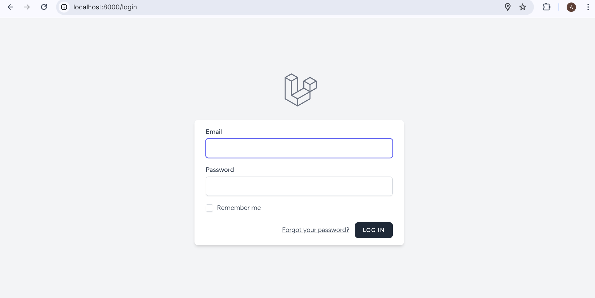
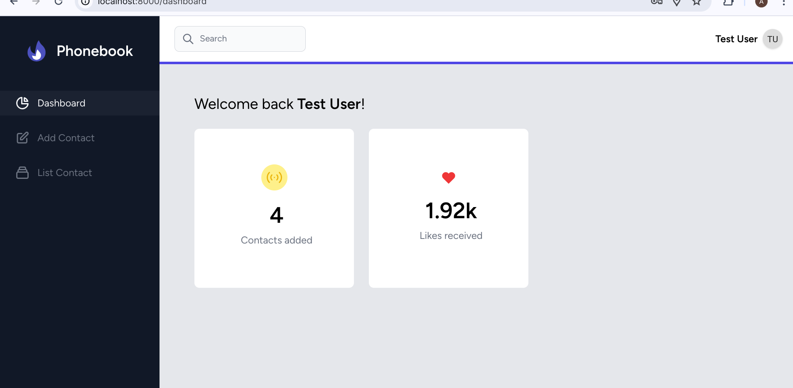
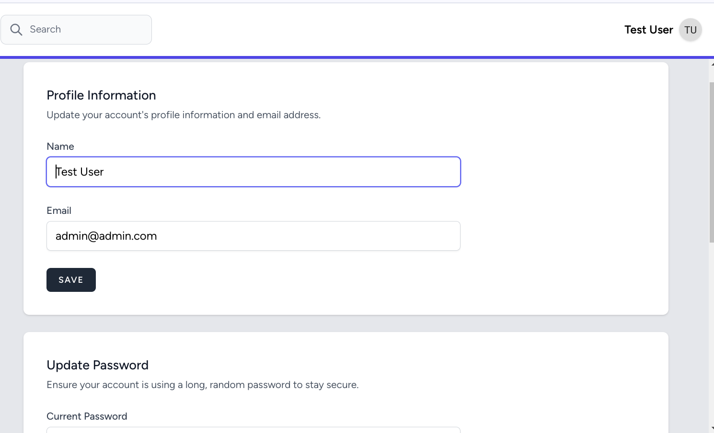
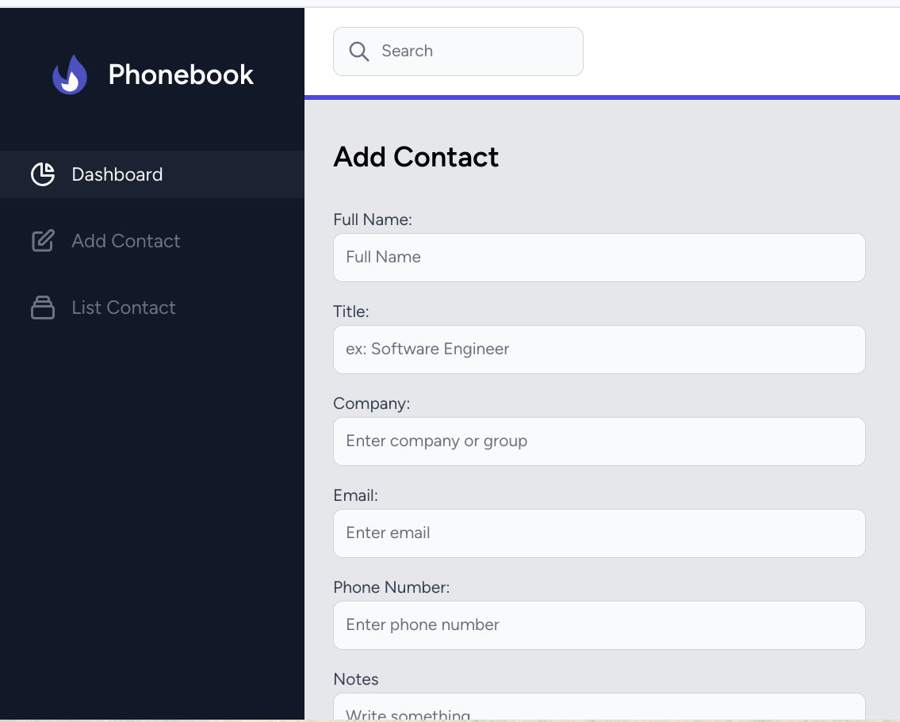
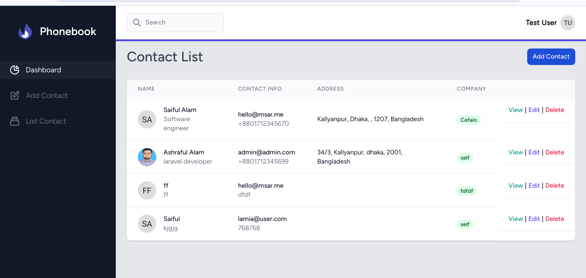
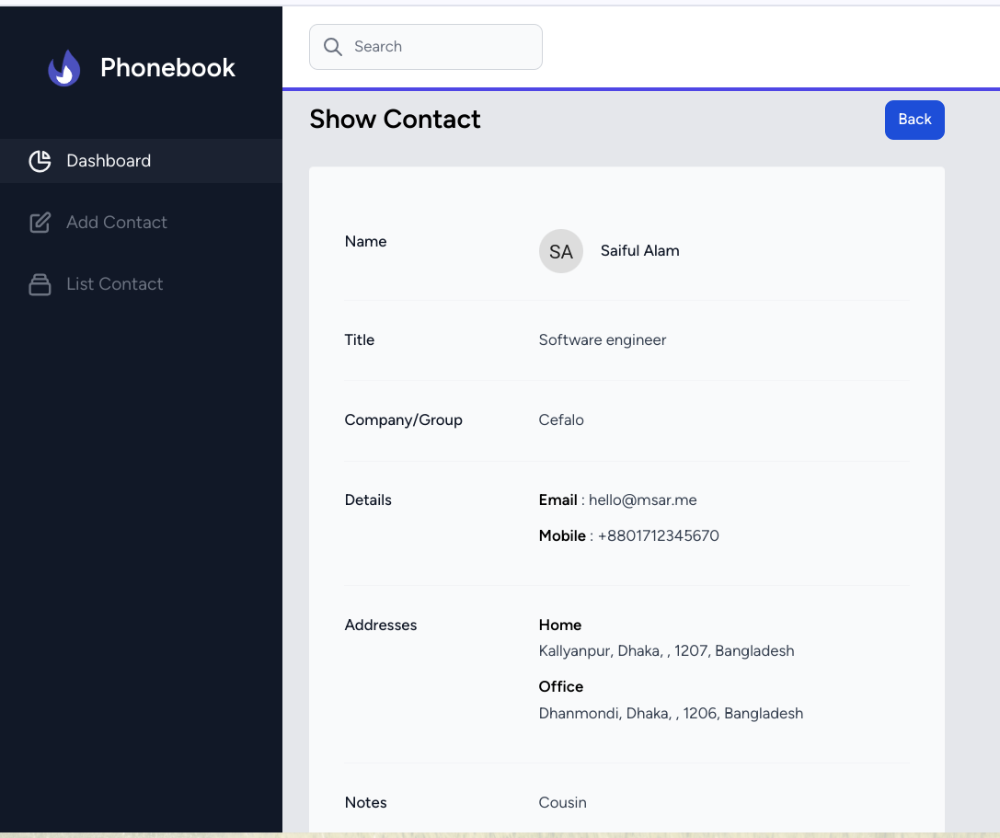
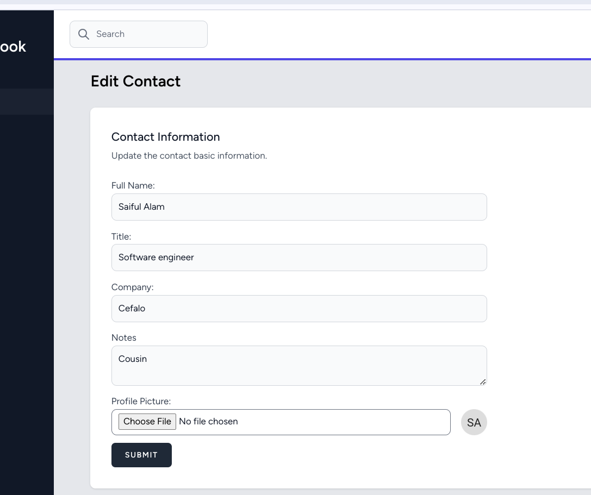
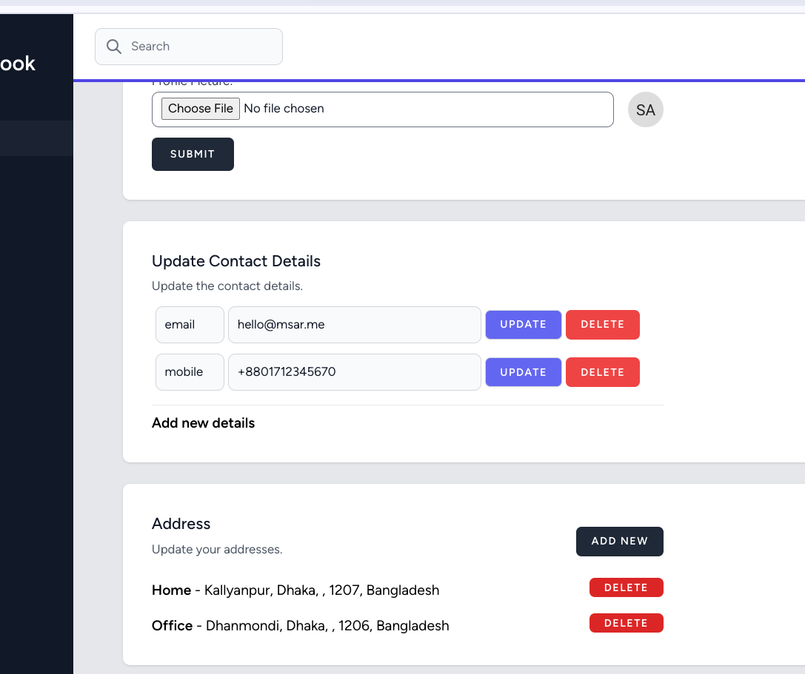

## PhoneBook App

Simple PhoneBook application with contacts list and details.

## Installation

To run this project simplly run the commands below.
Open your terminal in computer run these commands sequencially.

-   `git clone https://github.com/ashraful-raju/phonebook-laravel.git phonebook`
-   `cd phonebook`
-   `cp .env.example .env` and configure the `.env` file
-   `composer install`
-   `yarn install` or `npm install`
-   `php artisan key:generate`
-   `php artisan migrate --seed`
-   `yarn build`
-   `php artisan serve`

## Screenshots

## License

The Laravel framework is open-sourced software licensed under the [MIT license](https://opensource.org/licenses/MIT).
